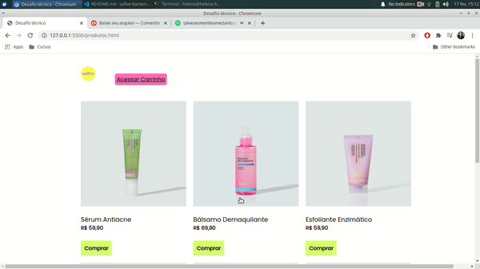
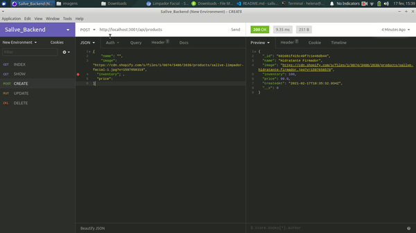
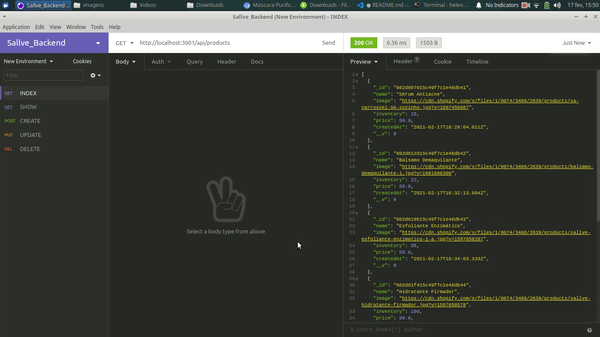
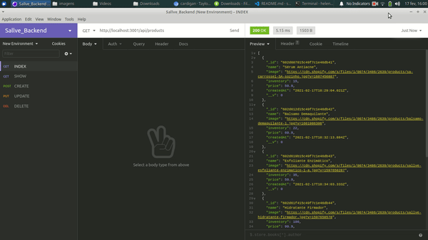
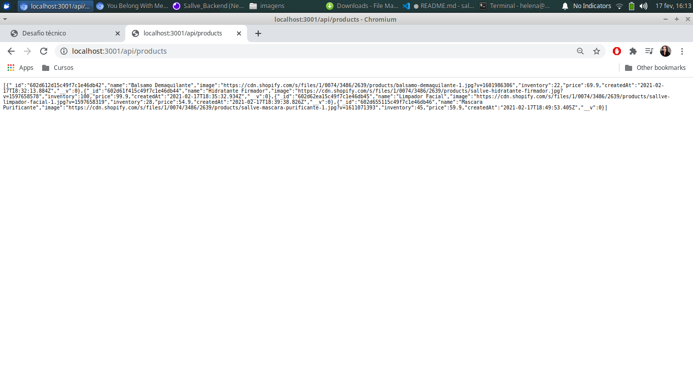
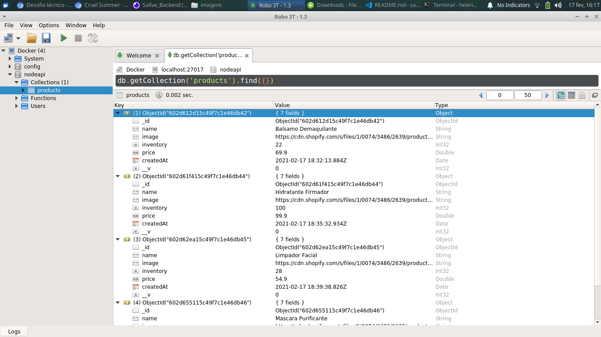

#  Desafio Técnico Sallve 

## Descrição
Desenvolvimento de projeto fullstack onde o backend foi construído utilizando Node.js, Nodemon, MongoDB e Insomnia e o frontend utiizando HTML, CSS e Javascript. 


## Índice
- [Requisitos](#Requisitos)
- [Instalação](#Instalação)
- [Uso](#Uso)
- [Imagens](#Imagens)


## Requisitos
- Siga os passos de instalação abaixo. 

## Instalação
- Utilizar o comando
  - No terminal, utilizar o comando: 

  ``` 
  npm install 
  ```
Obs: Ele é responsável por instalar todas as dependências de desenvolvimento utilizadas no projeto. Elas serão responsáveis pelo seu funcionamento correto. 

```
npm install express
```


## Uso
Para rodar a aplicação:
- No terminal, utilize o comando:
```
node server.js
```

Ele é responsável por fazer a conexão com o banco de dados;

No navegador, colocar o endereço: `http://localhost:3001/api/products` onde será possível acompanhar o backend/ CRUD da aplicação (ou fazendo o uso das interfaces Postman ou Insomnia)

```
npm install -D nodemon
```

Responsável por atualizar o servidor automaticamente (evita que a gente adicione um produto e desligue e ligue o servidor novamente)

```
npm run dev
```

Esse é o nome do script criado no package.json

---
Utilizando no navegador o endereço ou uma extensão como a live server dentro do arquivo produtos.html é possível ver a página principal da aplicação;
```
http://127.0.0.1:5500/produtos.html
```

## Imagens

- Página de produtos disponíveis para compra:

<p align="center">
  
</p>

- Página de carrinho:

<p align="center">
  
</p>

- Criação de um produto CREATE / POST - backend utilizando o insomnia:

<p align="center">
  
</p>

- Pegando um produto SHOW / GET - backend utilizando o insomnia:

<p align="center">
  
</p>

- Atualizando um produto UPDATE / PUT - backend utilizando o insomnia:

<p align="center">
  
</p>

- Deletando produtos DELETE / DEL - backend utilizando o insomnia:

<p align="center">
  
</p>

- Protudos cadastrados no banco de dados, expostos no caminho http://localhost:3001/api/products :

<p align="center">
  
</p>

- Protudos sendo persistidos no banco de dados, expostos na interface do Robo3t :

<p align="center">
  
</p>

